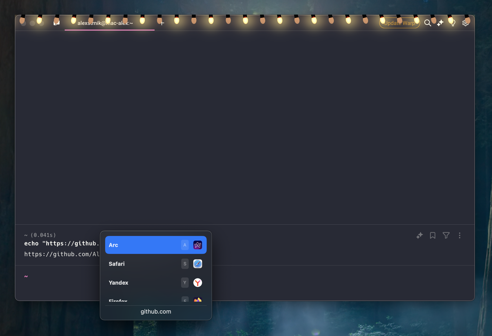

# Browserino

Browserino is a tiny browser selector for MacOS written in SwiftUI. Just set as default browser, assign shortcuts, and now you can choose in which application you want to open the link.

Inspired by great [Browserosaurus](https://github.com/will-stone/browserosaurus), but a little bit faster and smaller thanks to native code, and fixes annoying Electron bug.

# Installation

Download Browserino-Installer from the [releases page](https://github.com/AlexStrNik/Browserino/releases)
